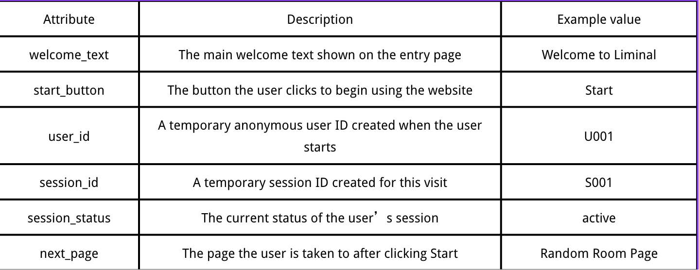
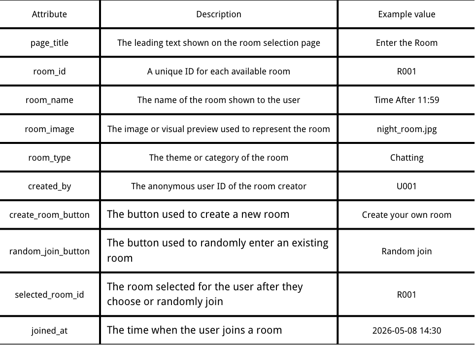
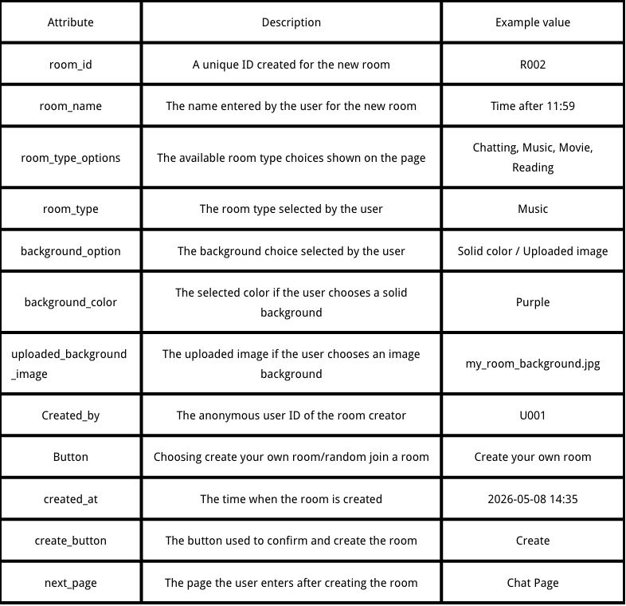
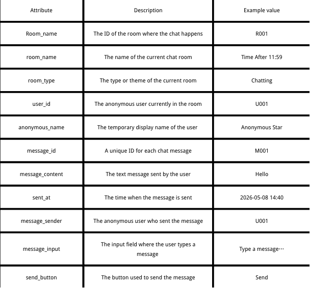
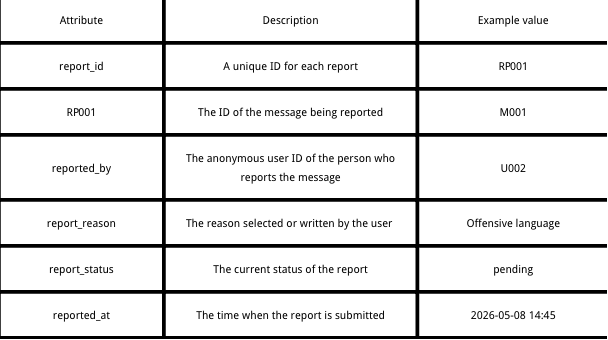

### Introduction
This week focuses on organising the anonymous chat system into DDD and ERD structures. Instead of mainly thinking about interface layout, the process begins to focus on what information the system needs to store and how different pages connect together. Through this process, the project starts moving from a visual wireframe into a more complete system structure.The system is better understood as a state-based interaction model rather than isolated pages.

---
### Entry Page

While analysing the Entry Page, I realised that even though the page looks simple, the system still needs to create a `user_id` and `session_id` after the user clicks Start. Before doing the DDD table, I did not really think about how anonymous users are separated inside the system. This made me realise that anonymous interaction still requires some form of user tracking in the background.
Session-based identity creates a trade-off between anonymity and system control.

### Random Room Page

For the Random Room Page, I found that attributes such as `room_id`, `created_by`, and `joined_at` are important because they record what happens after the user enters a room.

For example:
- `room_id` distinguishes different rooms,
- `created_by` records who created the room,
- `joined_at` records when the user entered the room.

At first, these attributes did not seem very important to me, but later I realised that without them, the system would not know where the user is or how room activity is happening.

### Create Room Page

The Create Room Page made me notice that visual customisation also creates extra system data. Features such as room themes, background colours, and uploaded images are not only visual choices, but also information the system needs to store.

This part made me realise that even small design features can increase system complexity because the platform needs to manage more data and relationships.

### Chat Page

The Chat Page feels like the core part of the whole system because almost all interaction happens there. While writing the DDD table, I realised that every message needs to connect with a room, a user, and a sending time.

Before this week, I mainly focused on what the chat page looked like visually, but now I understand that the chat system mainly works by storing interactions between users.

### More Mode Page

The More Mode Page extends the interaction experience beyond normal chatting. While thinking about this page, I realised that additional shared activities would also require more system structure. Even though the feature is still simple at the moment, it made me think more about how future interaction features may increase both data and interaction complexity.

### ERD Development
When converting the DDD into ERD, I started understanding the relationships between entities more clearly. For example, users and rooms are connected through interaction, and messages only exist because users send them inside rooms.

This process helped me stop thinking about the project as separate pages and start seeing it more as a connected system.

---
### Reflection
This week helped me better understand how user interaction connects with backend structure. Through DDD and ERD, I started thinking more about how information moves through the platform instead of only focusing on interface design.

The next step will move further into implementation and prototyping, especially focusing on whether room creation, room joining, and message interactions can function smoothly inside the system.
