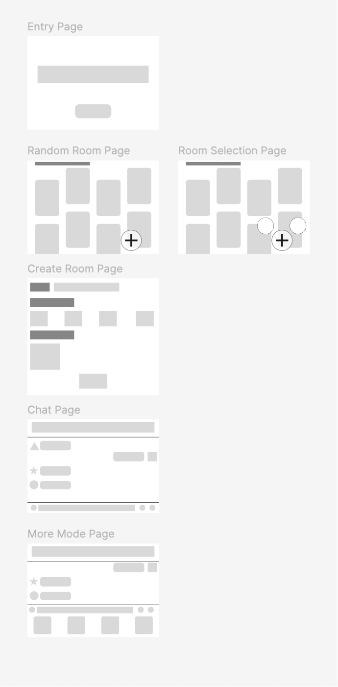

Introduction
This week focuses on developing the system into a wireframe and organising the user experience through a clear page structure. At this stage, the design does not emphasise visual detail, but instead focuses on how users move between different interaction stages. The overall goal is to construct a low-pressure, flexible, and anonymous social system that allows users to interact without burden or social expectation.

Entry Page
The entry page acts as the first point of contact with the system. It adopts a minimal design strategy by reducing visual and interactive elements to lower cognitive load. Users can enter the system quickly without complex steps or decision-making processes, which reduces the barrier to entry. This design strengthens the “instant access” experience and increases the likelihood of user engagement.

Home Page (Random Rooms)
After entering the system, users arrive at the home page where randomly generated rooms are displayed. Users can join conversations instantly without prior planning. This mechanism enhances serendipitous interaction, encouraging exploration of different social contexts while reducing decision-making effort and social pressure.

Plus Page (Room Options)
The “+” page acts as a functional branching point, offering users two choices: creating a room or joining an existing one. This page introduces a level of control on top of randomness, allowing users to adjust their interaction approach based on their needs. It balances system openness with user agency, supporting different behavioural patterns within the same structure.

Create Room Page
When users choose to create a room, they are taken to a setup page where they can define basic information such as the room’s topic or purpose. This step allows users to shape the interaction context and supports user-generated content within the system.

Chat Page
The chat page is the core interaction space of the system. Users communicate through a simple text-based interface, with no visible identity information. This anonymity reduces social pressure and evaluation anxiety, allowing users to express themselves more freely. The interface prioritises clarity and focus, ensuring communication remains the central experience.

More Mode Page
The “More Mode” page extends basic chatting functionality by introducing optional shared activities, such as listening to music together during interaction (possibly). This feature enhances the sense of presence and companionship without increasing system complexity, creating a more layered interaction experience.

Reflection
The next step will move into programming and implementation, transforming the current wireframe into a functional interactive prototype. In this process, attention will be given to page navigation logic, as well as finer implementation details such as whether room generation and joining mechanisms function reliably.
Overall, this phase establishes a clear structural foundation for implementation, enabling the transition from conceptual wireframes to a functional interactive prototype.